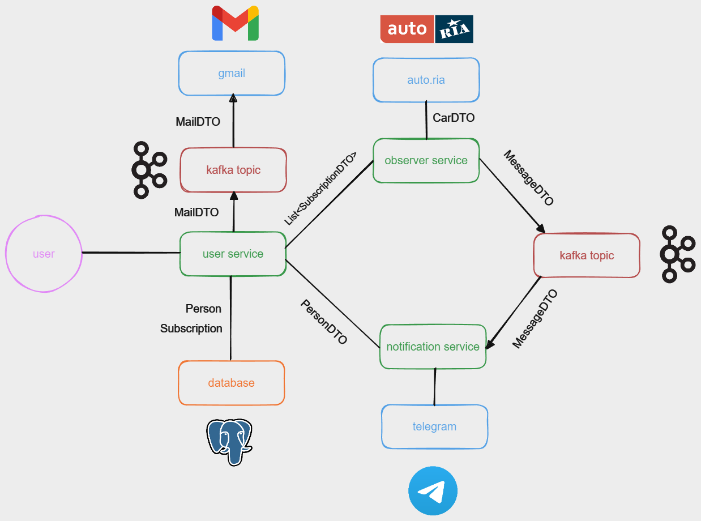
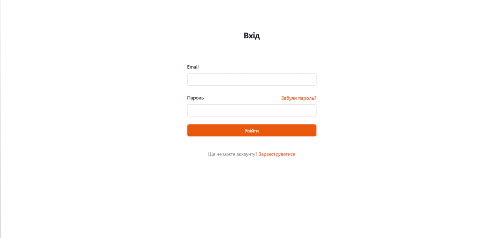
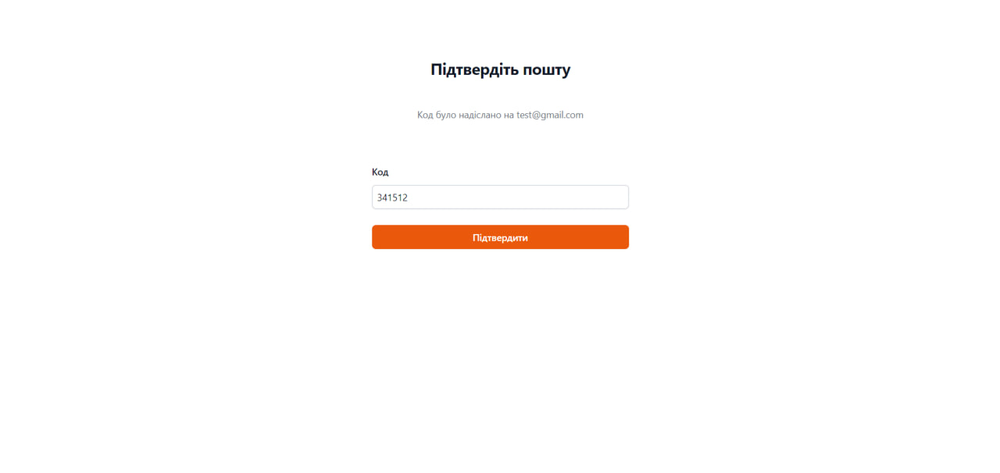
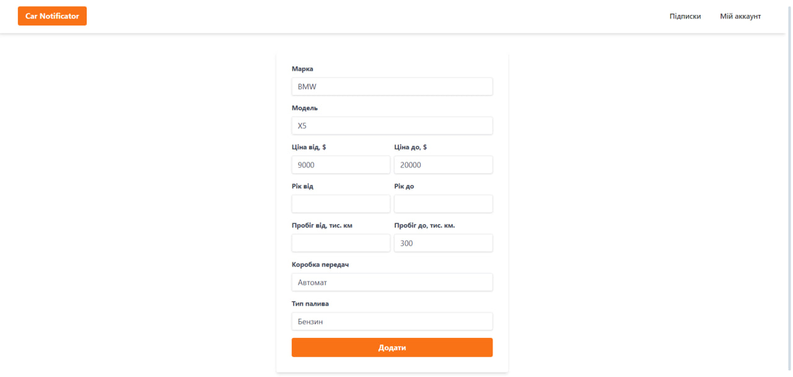
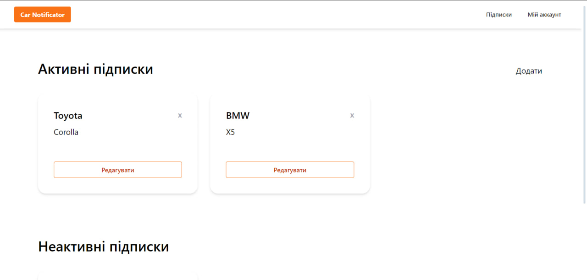
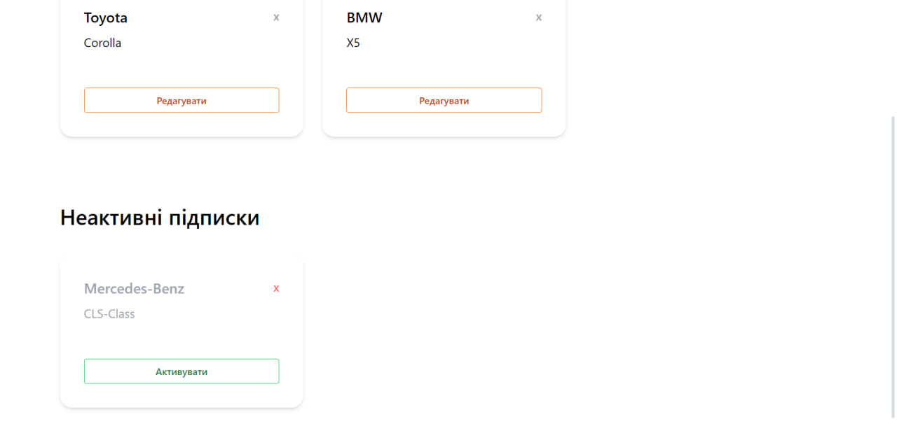
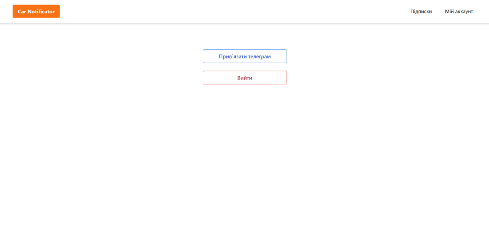
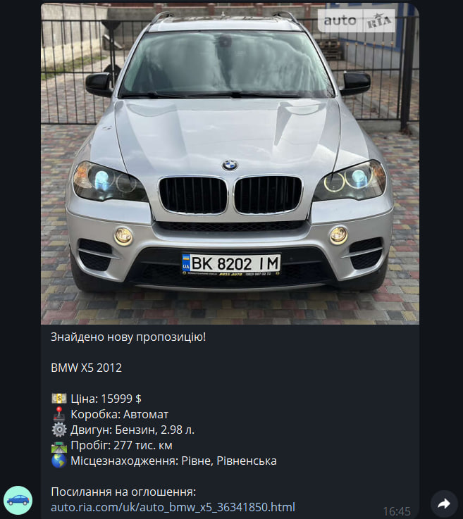

# Car Notificator
**Web service for sending notifications about the availability of new cars for sale.**
## Used technologies
- Java 21
- Spring Framework
  - Spring Boot
  - Spring Web
  - Spring Security
  - Spring Data JPA
  - Spring Test
- Apache Maven
- Hibernate
- PostgreSQL
- Apache Kafka
- Docker
- Flyway
- Thymeleaf
- Tailwind CSS
## Architecture schema

## Services description
### User service
- Registers new users
- Identifies and authorize users
- Provides operations with subscriptions
- Works with email services
- Works with database
### Observer service
- Observers an availability of new cars for sale
- Collect information about new cars and send messages to users by notification service
- Form messages for users
### Notification service
- Provides Telegram bot for users interaction
- Implements connecting Telegram account with CarNotificator account
- Sends messages to users
## Screenshots

